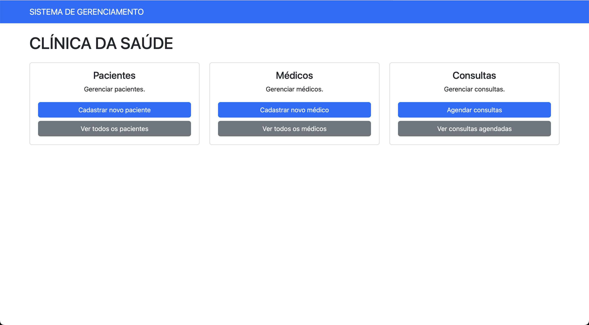
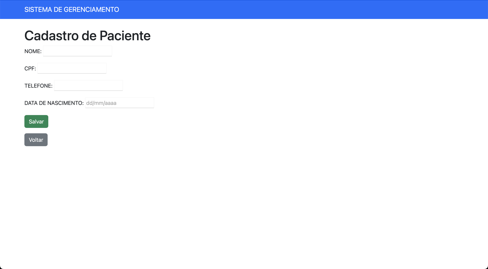
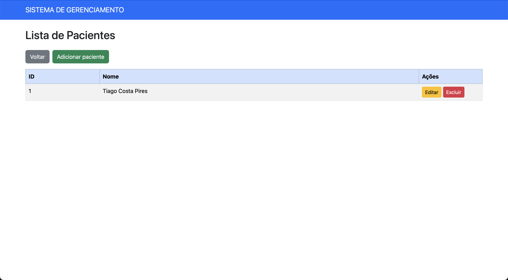
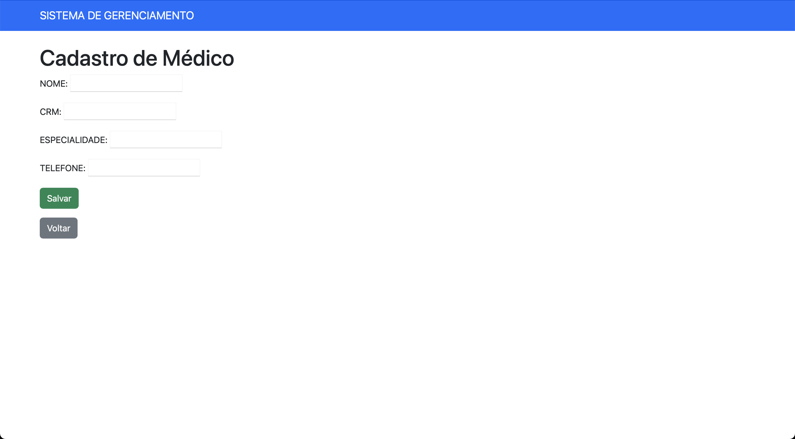
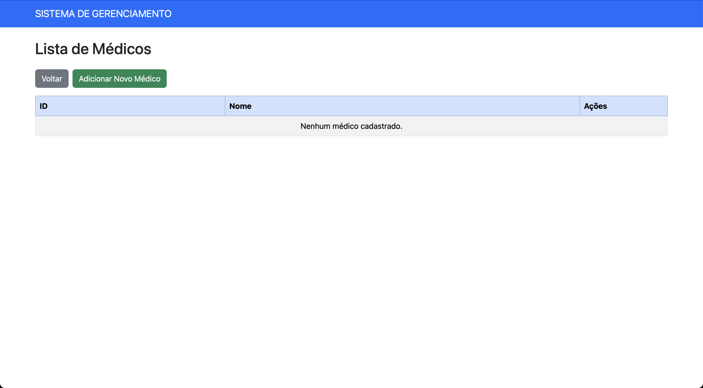
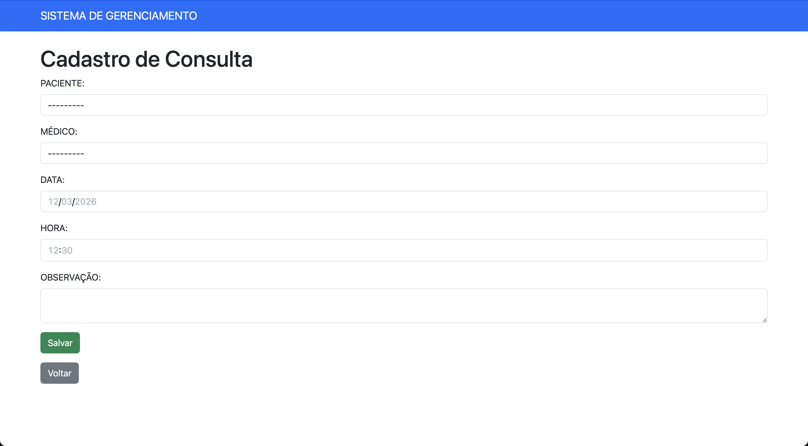
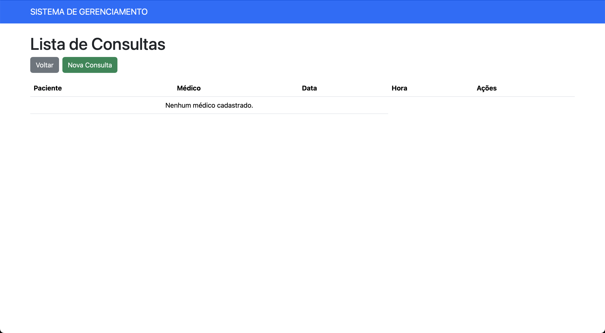

# Sistema de Clínica Médica

Sistema web desenvolvido em Django para gerenciamento de uma clínica médica.

## Funcionalidades

- Cadastro de pacientes
- Cadastro de médicos
- Cadastro de consultas
- Edição e exclusão de registros (CRUD)

## Tecnologias utilizadas

- Python
- Django
- SQLite
- HTML / CSS

## Telas do Sistema

### Página inicial

### Cadastro de pacientes

### Lista de pacientes

### Cadastro de médicos

### Lista de médicos

### Cadastro de consultas

### Lista de consultas

## Autor

Tiago Costa Pires